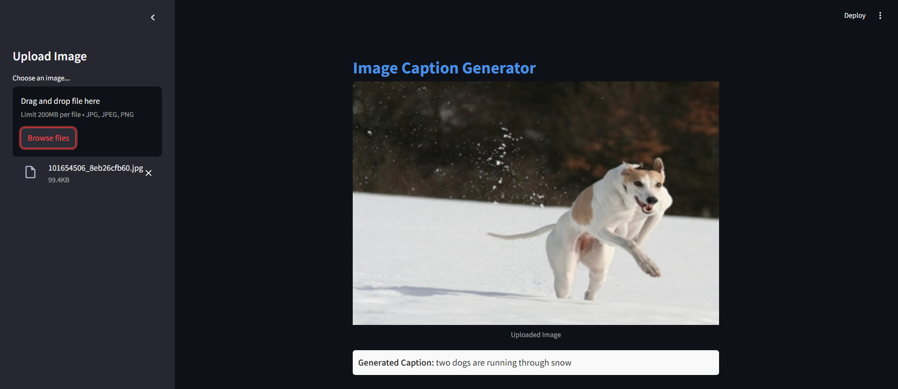

# Image Caption Generator

An image captioning application that generates descriptive captions for images using deep learning. This project leverages the VGG16 model for image feature extraction and an LSTM-based model for caption generation. The application includes an interactive GUI built with Streamlit.

## Project Overview

This project creates an Image Caption Generator that describes images with meaningful text. Using VGG16 for visual feature extraction and an LSTM network for caption generation, it combines state-of-the-art computer vision and natural language processing techniques.

### Key Steps

1. **Image Feature Extraction**:
   - The pre-trained VGG16 model is used to capture high-level image features.
   - Activations from the model’s second-to-last layer are extracted, focusing on visual information without the final classification layer.
2. **Text Tokenization**:

   - Captions are tokenized with TensorFlow's Tokenizer class, splitting text into individual words and building a vocabulary.
   - Special tokens `startseq` and `endseq` mark the beginning and end of each caption.

3. **Sequence Padding**:

   - All captions are padded to a consistent length, ensuring uniform input size for efficient model training.

4. **Model Structure**:

   - **Encoder**: Extracts and processes image features via VGG16 and a dense layer.
   - **Text Processing**: Captions are embedded and processed using an LSTM layer.
   - **Decoder**: Combines image and text features to generate the next word in the caption sequence.

5. **Training and Inference**:

   - The model is trained to predict the next word in a sequence using categorical cross-entropy loss.
   - At inference, caption generation begins with `startseq` and continues until `endseq` or the maximum sequence length is reached.

6. **Evaluation**:
   - Model performance is assessed with BLEU scores (BLEU-1 and BLEU-2), comparing generated captions to actual captions.

This project is presented with a Streamlit-based interface where users can upload images and receive captions instantly.

For in-depth details, please refer to the `notebooks/image_caption_generator.ipynb` file.

## Installation

Follow these steps to set up the project:

### 1. Clone the Repository

```bash
git clone https://github.com/yourusername/image-caption-generator.git
cd image-caption-generator
```

### 2. Install Requirements

Install all dependencies listed in the `requirements.txt` file:

```bash
pip install -r requirements.txt
```

### 3. Download Models and Tokenizer

- **Image Caption Model (LSTM)**: Download `model_epoch_7_keras.keras` and place it in the `Models` folder.
- **Tokenizer**: Download `tokenizer_1.pkl` and place it in the project root folder.

Ensure paths in the code match the locations of these files.

### 4. Run the Application

Launch the Streamlit app with:

```bash
streamlit run app.py
```

## Usage

1. **Open the App**: When the Streamlit app starts, a browser window will open displaying the GUI.
2. **Upload Image**: Upload an image in `.jpg`, `.jpeg`, or `.png` format.
3. **View Generated Caption**: Once the image is uploaded, the app will display the image and its generated caption below.

## Example

Upload an image to see results like:


**Generated Caption**: _A dog is running through the snow._

## Future Improvements

- **Model Optimization**: Experiment with alternative CNNs (e.g., ResNet or Inception) for feature extraction.
- **UI Enhancements**: Further improve the user interface.
- **Multi-Language Support**: Train models to generate captions in multiple languages.

## Contributing

Contributions are welcome! Feel free to open issues or submit pull requests.

## License

This project is licensed under the MIT License. See the [LICENSE](LICENSE) file for details.

## Acknowledgments

- This project utilizes the VGG16 model from Keras.
- Inspired by advancements in computer vision and natural language processing.
